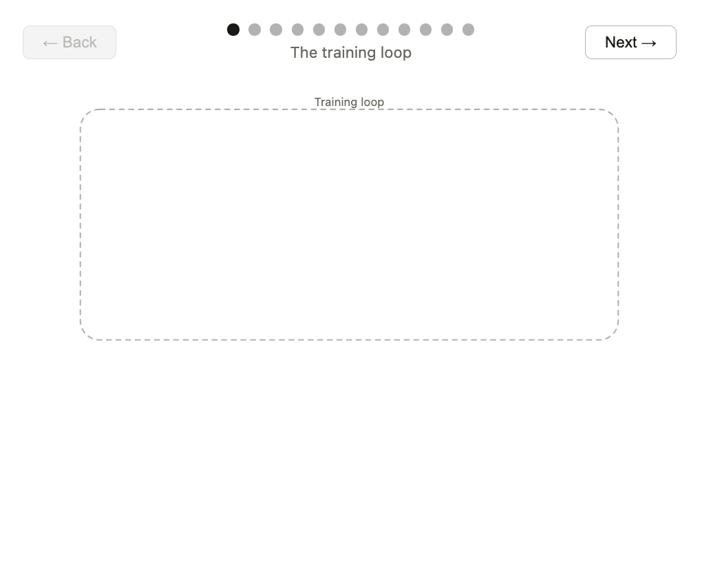

# Foundations and Standards

**Morning session — AI-Assisted Development for Laravel Teams**

<!-- end_slide -->

## Opening scenario

Your colleague has just pasted your team's internal OpenAPI spec into ChatGPT to get help understanding one of the endpoints.

They got a great explanation. No data was leaked — it's just schema definitions, no real values.

**Type in chat: fine / not fine / depends**

We'll come back to this at the end of the session.

<!-- end_slide -->

## Where we're going today

Four things by the end of this morning:

<!-- incremental_lists: true -->
- A shared vocabulary for AI-assisted development — so the team talks about the same thing
- How LLMs actually work — enough to reason about their behaviour and failure modes
- How to prompt deliberately — clarity, context, constraints, and iteration
- How to treat context as a first-class concern — not an afterthought

<!-- end_slide -->
## Shared vocabulary

Before anything else, let's align on terms.
<!-- column_layout: [1, 1] -->
<!-- column: 0 -->
LLM — Large Language Model.
<!-- pause -->
A model trained on text to predict likely next tokens. Not a database. Not a search engine. Not a reasoning engine (despite appearances).

Prompt
<!-- pause -->
The input you give the model. Everything it knows about your task comes from this.

Context window
<!-- pause -->
How much the model can "see" at once. Older models: ~4K tokens. Modern models: 128K–1M+. Matters for code-heavy tasks.

Harness

The scaffolding around the model — prompts, tools, retries, memory, orchestration. Most of what makes an LLM product "smart" lives here, not in the model itself.


Memory recall

The mechanism by which a system retains and retrieves information across turns or sessions — since the model itself is stateless, this lives entirely in the harness, not the LLM.
<!-- column: 1 -->
Hallucination
<!-- pause -->
Confident, fluent output that is factually wrong. A property of how these models work, not a bug to be fixed.

Grounding
<!-- pause -->
Anchoring model output to real, verifiable sources (your codebase, docs, tests).

Tokens
<!-- pause -->
The chunks of text a model reads and writes. Not words, not characters — sub-word pieces (e.g. "tokenization" → "token" + "iza" + "tion"). Roughly 0.75 words per token in English.

Guard rails

Constraints placed around model input and output — input filtering, output validation, allow/deny lists, human-in-the-loop checks. They catch what the model itself won't reliably catch on its own.
<!-- reset_layout -->
<!-- end_slide -->
## The LLM landscape

Multiple **model families**: GPT-4, Claude, Gemini, Llama...

Multiple **providers**: OpenAI, Anthropic, Google, Meta, Microsoft, open-source

Different **strengths**: code generation, reasoning, long context, speed, cost

<!-- pause -->

**The practical question isn't which is best — it's which fits your task and your data policy.**

<!-- end_slide -->

## Model families at a glance

| Type | Examples |
|---|---|
| Generalist | GPT-4, Claude, Gemini |
| Code-focused | GitHub Copilot, Codex lineage |
| Open / local | Llama, Mistral, Codestral |
| Enterprise | Azure OpenAI, GitHub Copilot for Business, AWS Bedrock |

No single "best" — fit depends on task, data classification, and environment.

<!-- end_slide -->

## How an LLM is actually trained

<!-- column_layout: [2, 1] -->

<!-- column: 0 -->



<!-- column: 1 -->

A model is not a database. It has no memory of individual facts.

It learned **statistical patterns** across a massive corpus of text — enough to predict what a plausible next token looks like in almost any context.

<!-- pause -->

Two things follow directly from this:
- It can produce fluent, confident output that is **factually wrong**
- The corpus it trained on **shapes everything it knows and assumes**

<!-- end_slide -->

## Your data and the training corpus

When you send a prompt to a public AI tool, that interaction may enter a future training pipeline.

<!-- pause -->

This means:
- Proprietary code you paste could influence outputs **for other users**
- Internal API designs, data schemas, and system descriptions could leak — not as a breach, but as a subtle shaping of what the model "knows"
- There is no way to retrieve or delete data once it has been used for training

<!-- pause -->

**Enterprise tools contractually exclude your data from training.** That is the reason the distinction matters — not just policy, but the mechanics of how these models evolve.

<!-- end_slide -->

## The critical distinction: public vs. enterprise

| | Public (e.g. ChatGPT free) | Enterprise (e.g. Copilot for Business) |
|--|--|--|
| Data handling | Provider policy | Your tenant / contract |
| Used for training | Often permitted | Typically excluded |
| Internal docs | Do not send | When policy allows |
| Proprietary code | Do not paste | Per governance |

<!-- pause -->

**What you send and where it is processed determines risk.**

<!-- end_slide -->

## Quick classification — type in chat

Where does each one belong? **P** = public AI fine, **E** = enterprise only, **N** = no AI

<!-- incremental_lists: true -->
1. A regex to validate a UK postcode format
2. The connection string logic for your production database
3. An internal REST API's OpenAPI spec (no real data, just schema)
4. A unit test for a public-facing DTO

<!-- end_slide -->

## Where hallucination and bias come from

Both are properties of the training process, not bugs to be patched.

**Hallucination** happens because the model is optimised to produce *plausible* output, not *true* output. It has no mechanism to distinguish between "I know this" and "this sounds right."

<!-- pause -->

**Bias** happens because the corpus was not a neutral sample of human knowledge. It over-represented some voices, languages, and perspectives — and the model reflects that, whether you can see it or not.

<!-- pause -->

Neither will be "fixed." They are managed — through verification, grounding, and knowing when not to trust the output.

<!-- end_slide -->

## Cut-offs and verification

The training corpus has a **fixed end date**.

- "What's new in Laravel 12?" may be incomplete, wrong, or missing entirely
- Library versions, package APIs, and security advisories go stale fast

<!-- pause -->

**Practical rule:** anything with a version number gets verified against the official docs before it goes into production.

<!-- end_slide -->

## Trust but verify

| Rely on (with light check) | Double-check or avoid |
|----------------------------|-----------------------|
| Syntax and style | Security and auth logic |
| Well-documented public APIs | Internal / proprietary APIs |
| Refactors with tests | Legal / compliance wording |
| Explanations of your code | Facts, figures, versions |

<!-- end_slide -->

## Back to the opening scenario

Your colleague pasted the internal OpenAPI spec into ChatGPT.

**Was it fine?**

<!-- pause -->

The spec contained no real data — but it revealed endpoint paths, request/response schemas, and internal data models.

That is proprietary system architecture. Public AI tools may retain it. It goes into a provider you don't control.

<!-- pause -->

**Rule of thumb**: when in doubt about whether something is proprietary, use enterprise AI or don't send.

<!-- end_slide -->

## Exercise

- Write down three daily tasks that you would feel comfortable relying on AI for

- Write down three daily tasks that you wouldn't use AI for (or at least be cautious)

<!-- end_slide -->


## Prompt engineering: the core problem

A developer on your team asks AI:

> "Write some code for Laravel"

The output is generic boilerplate — a Hello World controller, nothing close to what they needed.

**Type in chat: what's the single most important thing missing from that prompt?**

- Context
    - What to do?
    - Why?
    - What exists already?
    - Version
    - Testing strategy
    - Platform
- Task

<!-- end_slide -->

## The three Cs

Every developer prompt that works has three things.

**Clarity** — what do you want the model to do?
Task: generate, explain, refactor, test, debug

**Context** — what does the model need to know?
Stack, version, existing code, file, constraints

**Constraints** — what are the rules?
Style, patterns, things to avoid

<!-- pause -->

That prompt had none of them.

<!-- end_slide -->

## Clarity: task and format

Vague:
> "Write a controller"

<!-- pause -->

Clear:
> "Generate a Laravel API controller with one GET endpoint that returns a list of users as `JsonResponse`"

<!-- pause -->

The task is the verb. The format is what the output should look like.
If you can't state both in one sentence, the prompt isn't ready.

<!-- end_slide -->

## Context: stack, file, state

No context:
> "Generate a controller"

<!-- pause -->

With context:
> "I'm working in a Laravel 11 project using PHP 8.3 and constructor injection throughout. Add a new API controller for the Users resource. The `UserService` is already registered in the service container."

<!-- pause -->

Context tells the model what world it's operating in. Without it, it guesses — and it guesses the average of everything it's ever seen, which is rarely what you need.

<!-- end_slide -->

## Constraints: style, patterns, don'ts

No constraints:
> "Generate a Laravel controller"

<!-- pause -->

With constraints:
> "Use constructor injection via the service container — not the `app()` helper. Return `JsonResponse` with typed method returns. Follow the pattern in the existing `ProductsController`."

<!-- pause -->

Constraints are how you encode your team's standards. The model doesn't know your codebase — you have to tell it what good looks like.

<!-- end_slide -->

## Zero-shot, few-shot, chain-of-thought

These aren't techniques to memorise — they're descriptions of what you're already doing.

**Zero-shot**: just ask. Works for well-known patterns and quick lookups.
> "Explain what `JsonResponse` is in Laravel"

<!-- pause -->

**Few-shot**: give an example, ask for another. Works when style or format matters.
> "We write services like this: [example]. Generate a similar one for `OrderService`."

<!-- pause -->

**Chain-of-thought**: ask for reasoning before the answer. Works for complex tasks where accuracy matters.
> "First explain what this method does, then identify any issues, then show a refactored version."

<!-- end_slide -->

## When to use which

| Technique | Use when |
|---|---|
| Zero-shot | Well-known patterns, quick answers |
| Few-shot | You want specific style or format |
| Chain-of-thought | Complex refactoring, debugging, design decisions |

<!-- pause -->

**The practical rule:** start zero-shot. If the output doesn't match your needs, add an example (few-shot) or ask for reasoning first (chain-of-thought). Don't reach for complexity before you need it.

<!-- end_slide -->

## Iterative refinement

The first output is rarely the right output. That's not a failure — it's the process.

**Read the output as a diagnosis:**
- Wrong version or API? → Missing context
- Wrong style or patterns? → Missing constraints or a few-shot example
- Plausible but subtly incorrect? → Add chain-of-thought; ask it to reason before answering

<!-- pause -->

**Demo:** *(Run a vague prompt live — "Refactor this code" with no context — show the output, then diagnose it together. Ask the group: what would you add?)*

<!-- end_slide -->

## Context as code

The 3Cs apply to every prompt you write. But there is a more durable version of this: treating context as a **team asset**, not a per-prompt afterthought.

<!-- pause -->

**In practice, this means:**

- `.github/copilot-instructions.md` — team-wide Copilot instructions that apply to every conversation
- Prompt files in the repository — standard specs and templates the whole team can reuse
- AGENTS.md or similar — context files that agents and tools can read to understand your codebase conventions

<!-- pause -->

The goal: your team's standards should be encoded somewhere that AI tools can read, not held in individual heads and retyped into every prompt.

<!-- end_slide -->

## What goes in a context file

A useful `.github/copilot-instructions.md` for a Laravel team might contain:

```markdown
## Stack
Laravel 11, PHP 8.3, Eloquent ORM, Pest for testing, Mockery for mocks.

## Conventions
- Constructor injection throughout — never use the `app()` helper
- Return `JsonResponse` from all API controllers with typed method returns
- Form Requests for all validation — never validate inline in a controller
- Repository interfaces in `App\Repositories\Contracts\`

## Testing
- Use Pest. Tests live in `tests/Unit/` and `tests/Feature/`
- Mock repositories with Mockery. Never use the database in unit tests.
- Name tests as descriptions: `it('returns 404 when task not found')`

## What not to generate
- Security and auth logic — always written manually
- Payment processing — always written manually
```

<!-- end_slide -->

## The payoff

When context is encoded rather than improvised:

- Every team member's prompts produce consistent output
- Onboarding new developers means sharing a file, not tribal knowledge
- Code review of AI-generated code can reference the context file, not just intuition
- The context file becomes a living standards document

<!-- pause -->

**Discussion:** what would go in your team's context file right now? Type one item in chat.

<!-- end_slide -->

## Exercise: In the wild

Open your actual AI chat history — Copilot Chat sidebar, ChatGPT/Claude web history, Codex, whatever you've used this morning or in recent work. Find:

- One prompt that shows clarity, context, or constraints clearly. Note which one(s).
- One prompt that's an example of zero-shot, few-shot, or chain-of-thought (even if you didn't know the name for it at the time).
- Bonus: a spot where you refined a prompt across two or more turns and the output visibly improved.

Add it to the shared doc.

<!-- end_slide -->

## Summary

1. **Shared vocabulary**: LLM, prompt, hallucination, grounding — use the same words
2. **How they work**: statistical pattern prediction, not knowledge retrieval — this explains the failure modes
3. **Public vs. enterprise**: non-negotiable; internal data stays in-house
4. **The 3Cs**: clarity, context, constraints — every prompt that works has all three
5. **Iteration**: read bad output as a diagnosis, not a verdict
6. **Context as code**: encode team standards where AI tools can read them

<!-- end_slide -->

## What's next

**This afternoon:** Copilot in Depth — inline, Chat, the terminal, and working with your actual Laravel codebase.

The foundations from this morning apply throughout the day. If output isn't right, the diagnosis is always: clarity, context, or constraints.

<!-- end_slide -->

# Questions?

*Morning session — Foundations and Standards*
